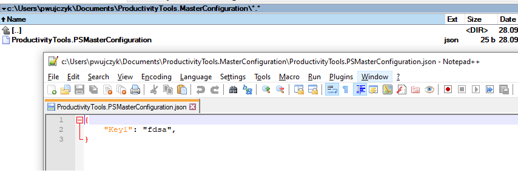
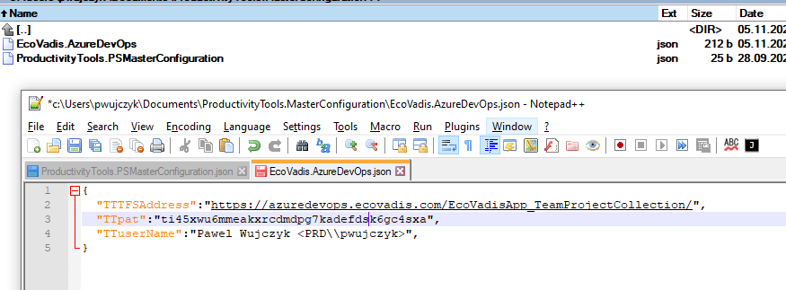
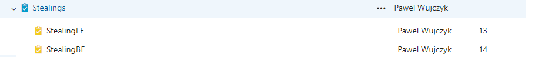

<!--Category:PowerShell--> 
 <p align="right">
    <a href="https://www.powershellgallery.com/packages/EcoVadis.AzureDevOps/"></a>
    <a href="http://productivitytools.tech/"><a> 
    <a href="https://github.com/pwujczyk/EcoVadis.AzureDevOps"></a>
</p>
<p align="center">
    <a href="http://http://productivitytools.tech/">
        
    </a>
</p>
# EcoVadis.AzureDevOps


## Setup MasterConfiguration
- Install PowerShell MasterConfiguration Module

```powershell
Install-Module -Name ProductivityTools.PSMasterConfiguration
```
- Setup EnvironmentVariable

```powershell
Set-MasterConfiguration
```
Check if in the path c:\Users\pwujczyk\Documents\ProductivityTools.MasterConfiguration\
 you have json file

 


## Setup AzureDevops

- Install Module from [PowerShell Gallery](https://www.powershellgallery.com/packages/EcoVadis.AzureDevOps/)

```powershell
Install-Module -Name EcoVadis.AzureDevOps	
```
- Create new file in the MasterConfiguration location


```
{
  "TTTFSAddress":"https://azuredevops.ecovadis.com/EcoVadisApp_TeamProjectCollection/",
  "TTpat":"ti45xwu6mmeakxrcdmdpg7kadefdsk6gc4sxa",
  "TTuserName":"Pawel Wujczyk <PRD\\pwujczyk>",
}
```

Use it.

```
New-FEStealing "StealingFE" 13
New-BEStealing "StealingBE" 14
Get-TFSItem 101856
 ```



